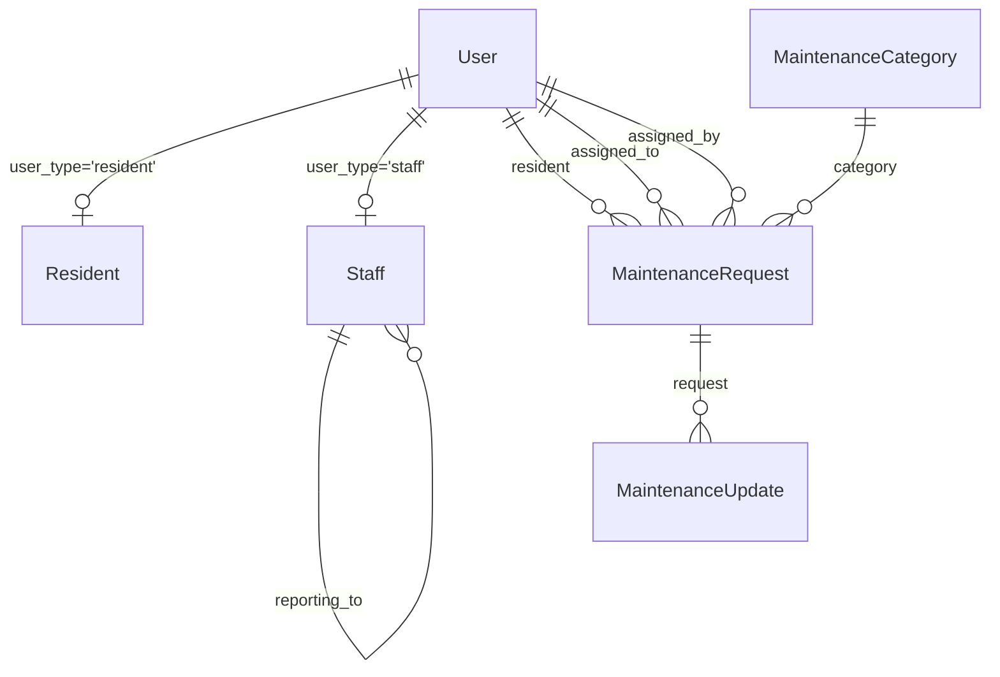

# The Khaki Estate - Technical Documentation
## Architecture, Models, Workflows & Implementation Guide

**Version**: 2.0  
**Last Updated**: December 2024  
**Target Audience**: Developers, System Architects, Technical Teams

---

## 📋 Table of Contents

1. [System Architecture Overview](#system-architecture-overview)
2. [Database Schema & Models](#database-schema--models)
3. [User Management System](#user-management-system)
4. [Maintenance Staff Architecture](#maintenance-staff-architecture)
5. [Maintenance Request Workflow](#maintenance-request-workflow)
6. [Permission & Access Control](#permission--access-control)
7. [Forms & Validation](#forms--validation)
8. [Views & URL Patterns](#views--url-patterns)
9. [Tasks & Background Processing](#tasks--background-processing)
10. [Signals & Event Handling](#signals--event-handling)
11. [Admin Interface](#admin-interface)
12. [Testing Strategy](#testing-strategy)
13. [API Design Patterns](#api-design-patterns)
14. [Performance Considerations](#performance-considerations)
15. [Deployment & Migration Guide](#deployment--migration-guide)

---

## 🏗️ System Architecture Overview

### Technology Stack
- **Backend Framework**: Django 5.2.6
- **Database**: PostgreSQL with Neo4j integration [[memory:8337724]]
- **Task Queue**: Celery with Redis/RabbitMQ
- **Package Manager**: uv (modern Python package management)
- **Testing**: pytest with factory_boy
- **Admin Interface**: Enhanced Django Admin

### Core Components
```
┌─────────────────────────────────────────────────────────────┐
│                    THE KHAKI ESTATE                         │
│                 Management System v2.0                     │
├─────────────────────────────────────────────────────────────┤
│  Users Module          │  Backend Module                    │
│  ├── User (Enhanced)   │  ├── Resident                     │
│  ├── Staff (NEW)       │  ├── Staff (NEW)                  │
│  └── Forms             │  ├── MaintenanceRequest (Enhanced) │
│                        │  ├── Announcement                  │
│                        │  ├── Booking                       │
│                        │  ├── Event                         │
│                        │  └── Notification                  │
├─────────────────────────────────────────────────────────────┤
│  Admin Interface       │  Tasks & Signals                   │
│  ├── UserAdmin         │  ├── notification_tasks.py         │
│  ├── StaffAdmin (NEW)  │  ├── maintenance_signals.py        │
│  └── Enhanced Models   │  └── celery_app.py                 │
└─────────────────────────────────────────────────────────────┘
```

---

## 🗄️ Database Schema & Models

### Enhanced User Model (`users/models.py`)

```python
class User(AbstractUser):
    """
    Enhanced User model with user type distinction.
    Supports both residents and maintenance staff.
    """
    
    USER_TYPE_CHOICES = [
        ("resident", "Resident"),
        ("staff", "Staff"),
    ]
    
    # Core fields
    name = CharField(max_length=255, blank=True)
    user_type = CharField(
        max_length=10,
        choices=USER_TYPE_CHOICES,
        default="resident"
    )
    
    # Helper methods for type checking
    def is_resident(self) -> bool
    def is_staff_member(self) -> bool
```

**Key Design Decisions:**
- Single User model for all user types (residents and staff)
- `user_type` field enables role-based functionality
- Maintains backward compatibility with existing resident users
- Helper methods provide clean API for type checking

### Staff Model (`backend/models.py`)

```python
class Staff(models.Model):
    """
    Professional staff profile with role-based permissions.
    Handles maintenance staff, facility managers, accountants, etc.
    """
    
    STAFF_ROLES = [
        ("facility_manager", "Facility Manager"),
        ("accountant", "Accountant"),
        ("security_head", "Security Head"),
        ("maintenance_supervisor", "Maintenance Supervisor"),
        ("electrician", "Electrician"),
        ("plumber", "Plumber"),
        ("cleaner", "Cleaner"),
        ("gardener", "Gardener"),
    ]
    
    # Core identification
    user = OneToOneField(User, related_name="staff")
    employee_id = CharField(max_length=20, unique=True)
    staff_role = CharField(max_length=25, choices=STAFF_ROLES)
    
    # Permissions (role-based access control)
    can_access_all_maintenance = BooleanField(default=False)
    can_assign_requests = BooleanField(default=False)
    can_close_requests = BooleanField(default=False)
    can_manage_finances = BooleanField(default=False)
    can_send_announcements = BooleanField(default=False)
    
    # Employment & hierarchy
    employment_status = CharField(max_length=15, choices=EMPLOYMENT_STATUS)
    hire_date = DateField()
    reporting_to = ForeignKey("self", null=True, blank=True)
    
    # Business logic methods
    def can_handle_maintenance(self) -> bool
    def is_facility_manager(self) -> bool
    def is_accountant(self) -> bool
    def get_subordinate_count(self) -> int
```

**Design Patterns:**
- **One-to-One Relationship**: Each User can have one Staff profile
- **Self-Referencing FK**: Enables hierarchical reporting structure
- **Permission Fields**: Granular control over staff capabilities
- **Role-Based Defaults**: Automatic permission assignment based on role

### Enhanced MaintenanceRequest Model (`backend/models.py`)

```python
class MaintenanceRequest(models.Model):
    """
    Enhanced maintenance request with staff assignment capabilities.
    Supports complete workflow from submission to closure.
    """
    
    STATUS_CHOICES = [
        ("submitted", "Submitted"),
        ("acknowledged", "Acknowledged"),
        ("assigned", "Assigned"),        # NEW
        ("in_progress", "In Progress"),
        ("resolved", "Resolved"),
        ("closed", "Closed"),
        ("cancelled", "Cancelled"),      # NEW
    ]
    
    # Enhanced assignment tracking
    assigned_to = ForeignKey(User, related_name="assigned_maintenance_requests")
    assigned_by = ForeignKey(User, related_name="assigned_maintenance_by")
    assigned_at = DateTimeField(null=True, blank=True)
    
    # Enhanced timestamp tracking
    acknowledged_at = DateTimeField(null=True, blank=True)
    resolved_at = DateTimeField(null=True, blank=True)
    closed_at = DateTimeField(null=True, blank=True)
    
    # Cost management
    estimated_cost = DecimalField(max_digits=10, decimal_places=2)
    actual_cost = DecimalField(max_digits=10, decimal_places=2)
    
    # Resident feedback
    resident_rating = IntegerField(choices=[(i, f"{i} Stars") for i in range(1, 6)])
    resident_feedback = TextField(blank=True)
    
    # Business logic methods
    def assign_to_staff(self, staff_user, assigned_by_user=None)
    def can_be_assigned_to(self, staff_user) -> bool
    def get_suitable_staff(self) -> QuerySet
    def is_overdue(self) -> bool
    def get_resolution_time(self) -> timedelta
```

**Workflow State Machine:**
```
submitted → acknowledged → assigned → in_progress → resolved → closed
     ↓                                                    ↓
 cancelled ←──────────────────────────────────────────────┘
```

### Database Relationships



---

## 👥 User Management System

### User Type Architecture

The system implements a **Single Table Inheritance** pattern for user management:

```python
# Base User model with type discrimination
class User(AbstractUser):
    user_type = CharField(choices=[("resident", "Resident"), ("staff", "Staff")])
    
    def is_resident(self) -> bool:
        return self.user_type == "resident"
    
    def is_staff_member(self) -> bool:
        return self.user_type == "staff"

# Profile models extend the base User
class Resident(models.Model):
    user = OneToOneField(User, related_name="resident")
    # Resident-specific fields...

class Staff(models.Model):
    user = OneToOneField(User, related_name="staff")
    # Staff-specific fields...
```

### User Creation Workflow

```python
# Resident registration workflow
def create_resident(user_data, resident_data):
    """
    1. Create User with user_type='resident'
    2. Create Resident profile linked to User
    3. Set default notification preferences
    4. Send welcome email notification
    """
    user = User.objects.create_user(**user_data, user_type="resident")
    resident = Resident.objects.create(user=user, **resident_data)
    # Trigger signals for notification setup
    return user, resident

# Staff registration workflow  
def create_staff(user_data, staff_data):
    """
    1. Create User with user_type='staff'
    2. Create Staff profile with role-based permissions
    3. Set work schedule and availability
    4. Configure notification preferences based on role
    """
    user = User.objects.create_user(**user_data, user_type="staff")
    
    # Set role-based permissions
    permissions = get_role_permissions(staff_data['staff_role'])
    staff = Staff.objects.create(user=user, **staff_data, **permissions)
    
    return user, staff
```

---

## 🔧 Maintenance Staff Architecture

### Role-Based Permission Matrix

| Role | Access All | Assign | Close | Finances | Announcements | Handle Maintenance |
|------|------------|--------|-------|----------|---------------|-------------------|
| **Facility Manager** | ✅ | ✅ | ✅ | ❌ | ✅ | ✅ |
| **Accountant** | ❌ | ❌ | ❌ | ✅ | ✅ | ❌ |
| **Maintenance Supervisor** | ✅ | ✅ | ✅ | ❌ | ❌ | ✅ |
| **Electrician** | ❌ | ❌ | ✅ | ❌ | ❌ | ✅ |
| **Plumber** | ❌ | ❌ | ✅ | ❌ | ❌ | ✅ |
| **Security Head** | ❌ | ❌ | ❌ | ❌ | ✅ | ❌ |
| **Cleaner** | ❌ | ❌ | ❌ | ❌ | ❌ | ❌ |
| **Gardener** | ❌ | ❌ | ❌ | ❌ | ❌ | ❌ |

### Staff Assignment Algorithm

```python
def get_suitable_staff(maintenance_request):
    """
    Smart staff assignment based on request category and staff expertise.
    
    Algorithm:
    1. Filter active staff members
    2. Check role-based permissions
    3. Match expertise to request category
    4. Consider current workload
    5. Return ranked list of suitable staff
    """
    suitable_staff = Staff.objects.filter(
        is_active=True,
        user__is_active=True
    ).filter(
        Q(can_access_all_maintenance=True) |  # Facility Managers, Supervisors
        Q(staff_role__in=get_role_matches(request.category))  # Specialists
    )
    
    # Future enhancement: Add workload balancing
    # suitable_staff = suitable_staff.annotate(
    #     current_workload=Count('user__assigned_maintenance_requests', 
    #                           filter=Q(user__assigned_maintenance_requests__status__in=['assigned', 'in_progress']))
    # ).order_by('current_workload')
    
    return suitable_staff

def get_role_matches(category):
    """Map maintenance categories to suitable staff roles."""
    category_mapping = {
        'Electrical': ['facility_manager', 'maintenance_supervisor', 'electrician'],
        'Plumbing': ['facility_manager', 'maintenance_supervisor', 'plumber'],
        'HVAC': ['facility_manager', 'maintenance_supervisor'],
        'Security': ['facility_manager', 'security_head'],
        'Cleaning': ['facility_manager', 'cleaner'],
        'Landscaping': ['facility_manager', 'gardener'],
    }
    return category_mapping.get(category.name, ['facility_manager'])
```

---

## 🔄 Maintenance Request Workflow

### State Machine Implementation

```python
class MaintenanceRequestStateMachine:
    """
    Implements the maintenance request state machine with automatic
    timestamp tracking and validation.
    """
    
    VALID_TRANSITIONS = {
        'submitted': ['acknowledged', 'cancelled'],
        'acknowledged': ['assigned', 'in_progress', 'cancelled'],
        'assigned': ['in_progress', 'acknowledged', 'cancelled'],
        'in_progress': ['resolved', 'assigned', 'cancelled'],
        'resolved': ['closed', 'in_progress'],
        'closed': [],  # Terminal state
        'cancelled': [],  # Terminal state
    }
    
    def transition_to(self, new_status, user=None):
        """
        Safely transition request to new status with validation.
        
        Args:
            new_status: Target status
            user: User making the transition (for audit trail)
        
        Raises:
            InvalidTransition: If transition is not allowed
            PermissionDenied: If user lacks permission for transition
        """
        if new_status not in self.VALID_TRANSITIONS[self.status]:
            raise InvalidTransition(f"Cannot transition from {self.status} to {new_status}")
        
        if not self.can_user_transition(user, new_status):
            raise PermissionDenied(f"User {user} cannot transition to {new_status}")
        
        # Update status and set timestamp
        old_status = self.status
        self.status = new_status
        self._set_status_timestamp(new_status)
        
        # Trigger signals for notifications
        maintenance_status_changed.send(
            sender=self.__class__,
            instance=self,
            old_status=old_status,
            new_status=new_status,
            changed_by=user
        )
        
        self.save()

    def _set_status_timestamp(self, status):
        """Set appropriate timestamp based on status."""
        timestamp_mapping = {
            'acknowledged': 'acknowledged_at',
            'assigned': 'assigned_at', 
            'resolved': 'resolved_at',
            'closed': 'closed_at',
        }
        
        if status in timestamp_mapping:
            setattr(self, timestamp_mapping[status], timezone.now())
```

### Assignment Workflow

```python
class MaintenanceAssignmentService:
    """
    Service class for handling maintenance request assignments.
    Implements business logic for staff assignment and workload balancing.
    """
    
    @staticmethod
    def assign_request(request, staff_user, assigned_by_user):
        """
        Assign maintenance request to staff member.
        
        Workflow:
        1. Validate staff can handle request
        2. Check staff availability/workload
        3. Update request assignment fields
        4. Transition status to 'assigned'
        5. Send notifications
        6. Log assignment for audit
        """
        # Validation
        if not request.can_be_assigned_to(staff_user):
            raise ValidationError("Staff member cannot handle this request type")
        
        # Check workload (future enhancement)
        current_workload = MaintenanceRequest.objects.filter(
            assigned_to=staff_user,
            status__in=['assigned', 'in_progress']
        ).count()
        
        if current_workload >= settings.MAX_CONCURRENT_ASSIGNMENTS:
            raise ValidationError("Staff member has reached maximum workload")
        
        # Perform assignment
        request.assigned_to = staff_user
        request.assigned_by = assigned_by_user
        request.assigned_at = timezone.now()
        
        # Transition status
        if request.status in ['submitted', 'acknowledged']:
            request.status = 'assigned'
        
        request.save()
        
        # Trigger notifications
        send_assignment_notification.delay(request.id, staff_user.id)
        
        return request
    
    @staticmethod
    def get_workload_stats(staff_user):
        """Get current workload statistics for staff member."""
        return {
            'active_requests': MaintenanceRequest.objects.filter(
                assigned_to=staff_user,
                status__in=['assigned', 'in_progress']
            ).count(),
            'completed_this_month': MaintenanceRequest.objects.filter(
                assigned_to=staff_user,
                status='closed',
                closed_at__month=timezone.now().month
            ).count(),
            'avg_resolution_time': calculate_avg_resolution_time(staff_user),
            'satisfaction_rating': calculate_avg_satisfaction(staff_user),
        }
```

---

## 🔐 Permission & Access Control

### Permission Checking Framework

```python
class MaintenancePermissionMixin:
    """
    Mixin for views that need maintenance-related permission checking.
    Provides methods for checking various maintenance permissions.
    """
    
    def can_view_request(self, user, request):
        """Check if user can view specific maintenance request."""
        # Residents can view their own requests
        if user.is_resident() and request.resident == user:
            return True
        
        # Staff permissions
        if user.is_staff_member():
            staff = user.staff
            
            # Facility managers can view all
            if staff.can_access_all_maintenance:
                return True
            
            # Assigned staff can view their requests
            if request.assigned_to == user:
                return True
            
            # Supervisors can view subordinate's requests
            if request.assigned_to and request.assigned_to.staff.reporting_to == staff:
                return True
        
        return False
    
    def can_assign_request(self, user, request):
        """Check if user can assign maintenance request."""
        if not user.is_staff_member():
            return False
        
        return user.staff.can_assign_requests
    
    def can_close_request(self, user, request):
        """Check if user can close maintenance request."""
        if not user.is_staff_member():
            return False
        
        staff = user.staff
        
        # Staff with close permission
        if staff.can_close_requests:
            return True
        
        # Assigned staff can close their own requests
        if request.assigned_to == user:
            return True
        
        return False

# Decorator for view-level permission checking
def require_maintenance_permission(permission_method):
    """
    Decorator to check maintenance permissions before view execution.
    
    Usage:
    @require_maintenance_permission('can_assign_request')
    def assign_request_view(request, request_id):
        # View logic here
    """
    def decorator(view_func):
        def wrapper(request, *args, **kwargs):
            maintenance_request = get_object_or_404(MaintenanceRequest, pk=kwargs['request_id'])
            
            if not getattr(MaintenancePermissionMixin(), permission_method)(request.user, maintenance_request):
                raise PermissionDenied("Insufficient permissions for this action")
            
            return view_func(request, *args, **kwargs)
        return wrapper
    return decorator
```

### Role-Based View Access

```python
# views.py implementation example
class MaintenanceRequestListView(LoginRequiredMixin, ListView):
    """
    List view with role-based filtering.
    Shows different requests based on user type and permissions.
    """
    model = MaintenanceRequest
    template_name = 'backend/maintenance/list.html'
    context_object_name = 'requests'
    
    def get_queryset(self):
        """Filter requests based on user permissions."""
        user = self.request.user
        
        if user.is_resident():
            # Residents see only their requests
            return MaintenanceRequest.objects.filter(resident=user)
        
        elif user.is_staff_member():
            staff = user.staff
            
            if staff.can_access_all_maintenance:
                # Facility managers see all requests
                return MaintenanceRequest.objects.all()
            
            elif staff.can_handle_maintenance():
                # Technical staff see assigned requests + unassigned in their domain
                return MaintenanceRequest.objects.filter(
                    Q(assigned_to=user) |
                    Q(assigned_to__isnull=True, category__in=staff.get_expertise_categories())
                )
            
            else:
                # Other staff see only assigned requests
                return MaintenanceRequest.objects.filter(assigned_to=user)
        
        return MaintenanceRequest.objects.none()
    
    def get_context_data(self, **kwargs):
        """Add role-specific context data."""
        context = super().get_context_data(**kwargs)
        
        if self.request.user.is_staff_member():
            context.update({
                'can_assign': self.request.user.staff.can_assign_requests,
                'can_close': self.request.user.staff.can_close_requests,
                'staff_list': Staff.objects.filter(is_active=True, can_handle_maintenance=True),
                'workload_stats': get_workload_stats(self.request.user),
            })
        
        return context
```

---

## 📝 Forms & Validation

### StaffSignupForm Architecture (`users/forms.py`)

```python
class StaffSignupForm(SignupForm):
    """
    Multi-step staff registration form with role-based permission assignment.
    
    Workflow:
    1. Collect basic user information
    2. Collect staff-specific details
    3. Validate employee ID uniqueness
    4. Set role-based permissions automatically
    5. Create User and Staff profiles atomically
    """
    
    def __init__(self, *args, **kwargs):
        """
        Dynamic form initialization.
        Loads staff role choices from model to ensure consistency.
        """
        super().__init__(*args, **kwargs)
        
        # Import here to avoid circular imports
        from the_khaki_estate.backend.models import Staff
        
        # Dynamically set choices from model
        self.fields["staff_role"] = forms.ChoiceField(
            choices=Staff.STAFF_ROLES,
            widget=forms.Select(attrs={"class": "form-control"})
        )
    
    def clean_employee_id(self):
        """Validate employee ID uniqueness across all staff."""
        employee_id = self.cleaned_data.get("employee_id")
        if employee_id and Staff.objects.filter(employee_id=employee_id).exists():
            raise forms.ValidationError(
                "This employee ID is already registered. Please use a different ID."
            )
        return employee_id
    
    def save(self, request):
        """
        Atomic user and staff creation with role-based permissions.
        
        Transaction ensures both User and Staff are created successfully
        or both operations are rolled back.
        """
        with transaction.atomic():
            # Create user
            user = super().save(request)
            user.user_type = "staff"
            user.name = f"{self.cleaned_data.get('first_name', '')} {self.cleaned_data.get('last_name', '')}".strip()
            user.save()
            
            # Get role-based permissions
            permissions = self._get_default_permissions(self.cleaned_data["staff_role"])
            
            # Create staff profile
            Staff.objects.create(
                user=user,
                employee_id=self.cleaned_data["employee_id"],
                staff_role=self.cleaned_data["staff_role"],
                # ... other fields
                **permissions
            )
            
            # Trigger post-creation signals
            staff_created.send(sender=Staff, user=user, staff_role=self.cleaned_data["staff_role"])
            
            return user
    
    def _get_default_permissions(self, staff_role):
        """
        Get default permissions based on staff role.
        Centralized permission logic ensures consistency.
        """
        permission_matrix = {
            "facility_manager": {
                "can_access_all_maintenance": True,
                "can_assign_requests": True,
                "can_close_requests": True,
                "can_send_announcements": True,
            },
            "accountant": {
                "can_manage_finances": True,
                "can_send_announcements": True,
            },
            # ... other roles
        }
        
        return permission_matrix.get(staff_role, {})
```

### Form Validation Pipeline

```python
class MaintenanceRequestForm(forms.ModelForm):
    """
    Enhanced maintenance request form with staff assignment capabilities.
    """
    
    def __init__(self, *args, **kwargs):
        self.user = kwargs.pop('user', None)
        super().__init__(*args, **kwargs)
        
        # Customize assigned_to field based on user permissions
        if self.user and self.user.is_staff_member() and self.user.staff.can_assign_requests:
            self.fields['assigned_to'].queryset = Staff.objects.filter(
                is_active=True,
                can_handle_maintenance=True
            ).select_related('user')
        else:
            # Hide assignment field for users without permission
            del self.fields['assigned_to']
    
    def clean(self):
        """Cross-field validation for maintenance requests."""
        cleaned_data = super().clean()
        
        # Validate assignment permissions
        assigned_to = cleaned_data.get('assigned_to')
        if assigned_to and not self.instance.can_be_assigned_to(assigned_to):
            raise forms.ValidationError("Selected staff member cannot handle this request type")
        
        # Validate priority vs category
        priority = cleaned_data.get('priority')
        category = cleaned_data.get('category')
        if priority and category and priority > category.priority_level:
            self.add_error('priority', 'Priority cannot exceed category maximum')
        
        return cleaned_data
```

---

## 🌐 Views & URL Patterns

### View Architecture

```python
# backend/views.py - Enhanced maintenance views

class MaintenanceRequestCreateView(LoginRequiredMixin, CreateView):
    """
    Create maintenance request with automatic resident assignment.
    Supports both resident self-service and staff-assisted creation.
    """
    model = MaintenanceRequest
    form_class = MaintenanceRequestForm
    template_name = 'backend/maintenance/create.html'
    
    def get_form_kwargs(self):
        """Pass current user to form for permission-based customization."""
        kwargs = super().get_form_kwargs()
        kwargs['user'] = self.request.user
        return kwargs
    
    def form_valid(self, form):
        """Set resident and trigger workflow."""
        form.instance.resident = self.request.user
        
        # Auto-assign if staff member is creating for resident
        if self.request.user.is_staff_member() and not form.instance.resident:
            form.instance.resident = form.cleaned_data.get('resident')
        
        response = super().form_valid(form)
        
        # Trigger post-creation workflow
        maintenance_request_created.send(
            sender=MaintenanceRequest,
            instance=self.object,
            created_by=self.request.user
        )
        
        return response

class MaintenanceRequestAssignView(LoginRequiredMixin, UserPassesTestMixin, UpdateView):
    """
    Staff assignment view with permission checking and workflow automation.
    """
    model = MaintenanceRequest
    fields = ['assigned_to', 'estimated_completion', 'estimated_cost']
    template_name = 'backend/maintenance/assign.html'
    
    def test_func(self):
        """Check if user can assign requests."""
        return (self.request.user.is_staff_member() and 
                self.request.user.staff.can_assign_requests)
    
    def form_valid(self, form):
        """Handle assignment with proper workflow."""
        request_obj = form.instance
        assigned_to = form.cleaned_data['assigned_to']
        
        # Use assignment service for proper workflow
        MaintenanceAssignmentService.assign_request(
            request_obj,
            assigned_to,
            self.request.user
        )
        
        messages.success(
            self.request,
            f"Request {request_obj.ticket_number} assigned to {assigned_to.name}"
        )
        
        return redirect('backend:maintenance_detail', pk=request_obj.pk)

class StaffDashboardView(LoginRequiredMixin, UserPassesTestMixin, TemplateView):
    """
    Role-based staff dashboard with personalized content.
    """
    template_name = 'backend/staff_dashboard.html'
    
    def test_func(self):
        """Only staff members can access staff dashboard."""
        return self.request.user.is_staff_member()
    
    def get_context_data(self, **kwargs):
        """Provide role-specific dashboard data."""
        context = super().get_context_data(**kwargs)
        staff = self.request.user.staff
        
        # Base stats for all staff
        context.update({
            'staff_profile': staff,
            'my_requests': MaintenanceRequest.objects.filter(assigned_to=self.request.user),
            'workload_stats': MaintenanceAssignmentService.get_workload_stats(self.request.user),
        })
        
        # Role-specific data
        if staff.is_facility_manager():
            context.update({
                'all_requests': MaintenanceRequest.objects.all()[:10],
                'pending_assignments': MaintenanceRequest.objects.filter(
                    status__in=['submitted', 'acknowledged']
                ),
                'overdue_requests': MaintenanceRequest.objects.filter(
                    estimated_completion__lt=timezone.now(),
                    status__in=['assigned', 'in_progress']
                ),
                'team_performance': get_team_performance_stats(),
            })
        
        elif staff.is_accountant():
            context.update({
                'cost_summary': get_monthly_cost_summary(),
                'budget_alerts': get_budget_alerts(),
                'vendor_performance': get_vendor_stats(),
            })
        
        return context
```

### URL Pattern Architecture

```python
# backend/urls.py - Maintenance staff URLs

urlpatterns = [
    # Maintenance request management
    path('maintenance/', include([
        path('', MaintenanceRequestListView.as_view(), name='maintenance_list'),
        path('create/', MaintenanceRequestCreateView.as_view(), name='maintenance_create'),
        path('<int:pk>/', MaintenanceRequestDetailView.as_view(), name='maintenance_detail'),
        path('<int:pk>/assign/', MaintenanceRequestAssignView.as_view(), name='maintenance_assign'),
        path('<int:pk>/update-status/', MaintenanceStatusUpdateView.as_view(), name='maintenance_update_status'),
        path('<int:pk>/close/', MaintenanceCloseView.as_view(), name='maintenance_close'),
    ])),
    
    # Staff management
    path('staff/', include([
        path('dashboard/', StaffDashboardView.as_view(), name='staff_dashboard'),
        path('profile/', StaffProfileView.as_view(), name='staff_profile'),
        path('workload/', StaffWorkloadView.as_view(), name='staff_workload'),
        path('performance/', StaffPerformanceView.as_view(), name='staff_performance'),
    ])),
    
    # Admin/management views
    path('admin-panel/', include([
        path('staff-management/', StaffManagementView.as_view(), name='admin_staff_management'),
        path('reports/', MaintenanceReportsView.as_view(), name='admin_reports'),
        path('analytics/', MaintenanceAnalyticsView.as_view(), name='admin_analytics'),
    ])),
]
```

---

## ⚙️ Tasks & Background Processing

### Celery Task Architecture (`backend/tasks.py`)

```python
# Enhanced notification and workflow tasks

@shared_task(bind=True, max_retries=3)
def send_assignment_notification(self, request_id, staff_user_id):
    """
    Send notification when maintenance request is assigned to staff.
    
    Features:
    - Retry mechanism for failed deliveries
    - Multiple notification channels (email, SMS, in-app)
    - Template-based messaging
    """
    try:
        request = MaintenanceRequest.objects.get(id=request_id)
        staff_user = User.objects.get(id=staff_user_id)
        
        # Create in-app notification
        Notification.objects.create(
            recipient=staff_user,
            notification_type=NotificationType.objects.get(name='maintenance_assigned'),
            title=f'New Assignment: {request.title}',
            message=f'You have been assigned maintenance request {request.ticket_number}',
            data={
                'request_id': request.id,
                'priority': request.priority,
                'location': request.location,
                'url': f'/backend/maintenance/{request.id}/'
            }
        )
        
        # Send email if staff prefers email notifications
        if staff_user.staff.email_notifications:
            send_email_notification.delay(
                staff_user.email,
                'maintenance_assigned',
                {
                    'request': request,
                    'staff_member': staff_user.staff,
                }
            )
        
        # Send SMS for urgent requests if staff has SMS enabled
        if request.priority >= 3 and staff_user.staff.sms_notifications:
            send_sms_notification.delay(
                staff_user.staff.phone_number,
                f'URGENT: New maintenance assignment {request.ticket_number}. Check system for details.'
            )
    
    except Exception as exc:
        # Retry with exponential backoff
        raise self.retry(exc=exc, countdown=60 * (2 ** self.request.retries))

@shared_task
def process_overdue_requests():
    """
    Periodic task to identify and escalate overdue maintenance requests.
    
    Runs every hour to:
    1. Identify overdue requests
    2. Send escalation notifications
    3. Auto-reassign if necessary
    4. Update priority levels
    """
    overdue_requests = MaintenanceRequest.objects.filter(
        estimated_completion__lt=timezone.now(),
        status__in=['assigned', 'in_progress']
    )
    
    for request in overdue_requests:
        # Send escalation notification to facility manager
        facility_managers = Staff.objects.filter(
            staff_role='facility_manager',
            is_active=True
        )
        
        for fm in facility_managers:
            send_escalation_notification.delay(request.id, fm.user.id)
        
        # Log overdue status
        MaintenanceUpdate.objects.create(
            request=request,
            author=None,  # System-generated
            content=f"Request is overdue. Original completion: {request.estimated_completion}",
            status_changed_to=request.status
        )

@shared_task
def generate_staff_performance_report(staff_id, period='monthly'):
    """
    Generate comprehensive staff performance report.
    
    Metrics calculated:
    - Request completion rate
    - Average resolution time
    - Resident satisfaction scores
    - Cost efficiency (actual vs estimated)
    - Workload distribution
    """
    staff = Staff.objects.get(id=staff_id)
    
    # Calculate date range
    if period == 'monthly':
        start_date = timezone.now().replace(day=1)
    elif period == 'weekly':
        start_date = timezone.now() - timedelta(days=7)
    
    # Query performance data
    requests = MaintenanceRequest.objects.filter(
        assigned_to=staff.user,
        created_at__gte=start_date
    )
    
    performance_data = {
        'total_requests': requests.count(),
        'completed_requests': requests.filter(status='closed').count(),
        'avg_resolution_time': calculate_avg_resolution_time(requests),
        'avg_satisfaction': calculate_avg_satisfaction(requests),
        'cost_efficiency': calculate_cost_efficiency(requests),
        'on_time_completion': calculate_on_time_rate(requests),
    }
    
    # Generate and store report
    report = StaffPerformanceReport.objects.create(
        staff=staff,
        period=period,
        data=performance_data,
        generated_at=timezone.now()
    )
    
    return report.id
```

### Celery Configuration (`config/celery_app.py`)

```python
# Enhanced celery configuration for maintenance workflows

from celery import Celery
from celery.schedules import crontab

app = Celery("the_khaki_estate")
app.config_from_object("django.conf:settings", namespace="CELERY")

# Periodic tasks for maintenance management
app.conf.beat_schedule = {
    'process-overdue-requests': {
        'task': 'the_khaki_estate.backend.tasks.process_overdue_requests',
        'schedule': crontab(minute=0),  # Every hour
    },
    'daily-staff-reports': {
        'task': 'the_khaki_estate.backend.tasks.generate_daily_reports',
        'schedule': crontab(hour=6, minute=0),  # 6 AM daily
    },
    'weekly-performance-analysis': {
        'task': 'the_khaki_estate.backend.tasks.weekly_performance_analysis',
        'schedule': crontab(hour=8, minute=0, day_of_week=1),  # Monday 8 AM
    },
}

app.autodiscover_tasks()
```

---

## 📡 Signals & Event Handling

### Signal Architecture (`backend/signals.py`)

```python
from django.db.models.signals import post_save, pre_save
from django.dispatch import receiver, Signal
from django.contrib.auth import get_user_model

# Custom signals for maintenance workflow
maintenance_request_created = Signal()
maintenance_status_changed = Signal()
staff_created = Signal()
request_assigned = Signal()
request_completed = Signal()

User = get_user_model()

@receiver(post_save, sender=User)
def create_user_profile(sender, instance, created, **kwargs):
    """
    Automatically create appropriate profile when User is created.
    
    Workflow:
    - If user_type='resident' → Create Resident profile
    - If user_type='staff' → Staff profile creation handled by StaffSignupForm
    """
    if created and instance.user_type == 'resident':
        # Create minimal resident profile if not exists
        if not hasattr(instance, 'resident'):
            from the_khaki_estate.backend.models import Resident
            Resident.objects.create(
                user=instance,
                flat_number='TEMP',  # Will be updated during registration
                phone_number='',
                resident_type='owner'
            )

@receiver(maintenance_request_created)
def handle_new_maintenance_request(sender, instance, created_by, **kwargs):
    """
    Handle new maintenance request creation workflow.
    
    Actions:
    1. Send notification to facility managers
    2. Auto-assign if emergency priority
    3. Create initial audit log
    4. Schedule follow-up reminders
    """
    # Notify facility managers of new request
    facility_managers = Staff.objects.filter(
        staff_role='facility_manager',
        is_active=True,
        email_notifications=True
    )
    
    for fm in facility_managers:
        send_new_request_notification.delay(instance.id, fm.user.id)
    
    # Auto-assign emergency requests
    if instance.priority == 4:  # Emergency
        suitable_staff = instance.get_suitable_staff().filter(
            is_available_24x7=True
        ).first()
        
        if suitable_staff:
            instance.assign_to_staff(suitable_staff.user)
            send_emergency_assignment.delay(instance.id, suitable_staff.user.id)

@receiver(maintenance_status_changed)
def handle_status_change(sender, instance, old_status, new_status, changed_by, **kwargs):
    """
    Handle maintenance request status changes.
    
    Triggers different workflows based on status transition.
    """
    # Send notifications based on status
    notification_mapping = {
        'acknowledged': send_acknowledgment_notification,
        'assigned': send_assignment_notification,
        'in_progress': send_progress_notification,
        'resolved': send_completion_notification,
        'closed': send_closure_notification,
    }
    
    if new_status in notification_mapping:
        # Notify resident
        notification_mapping[new_status].delay(instance.id, instance.resident.id)
        
        # Notify relevant staff
        if instance.assigned_to:
            notification_mapping[new_status].delay(instance.id, instance.assigned_to.id)

@receiver(post_save, sender=MaintenanceRequest)
def maintenance_request_audit_log(sender, instance, created, **kwargs):
    """
    Create audit log for all maintenance request changes.
    Maintains complete history for compliance and analysis.
    """
    if not created:  # Only log updates, not creation
        # Track what changed
        changed_fields = []
        if hasattr(instance, '_state') and instance._state.db:
            old_instance = MaintenanceRequest.objects.get(pk=instance.pk)
            
            for field in instance._meta.fields:
                old_value = getattr(old_instance, field.name)
                new_value = getattr(instance, field.name)
                
                if old_value != new_value:
                    changed_fields.append({
                        'field': field.name,
                        'old_value': str(old_value),
                        'new_value': str(new_value)
                    })
        
        # Create audit log entry
        MaintenanceAuditLog.objects.create(
            request=instance,
            changed_fields=changed_fields,
            timestamp=timezone.now(),
            user=getattr(instance, '_changed_by', None)
        )

@receiver(staff_created)
def setup_staff_permissions(sender, user, staff_role, **kwargs):
    """
    Set up staff member permissions and initial configuration.
    
    Actions:
    1. Configure notification preferences based on role
    2. Set up default work schedule
    3. Create initial performance tracking record
    4. Send welcome notification
    """
    staff = user.staff
    
    # Role-based notification setup
    if staff_role in ['facility_manager', 'security_head']:
        staff.sms_notifications = True
        staff.urgent_only = False
    elif staff_role in ['electrician', 'plumber']:
        staff.sms_notifications = True
        staff.urgent_only = True
    
    staff.save()
    
    # Send welcome notification
    send_staff_welcome_notification.delay(user.id)
```

---

## 🎛️ Admin Interface

### Enhanced Admin Architecture (`backend/admin.py`)

```python
@admin.register(Staff)
class StaffAdmin(admin.ModelAdmin):
    """
    Comprehensive staff administration interface.
    
    Features:
    - Role-based filtering and search
    - Permission management
    - Performance tracking integration
    - Bulk operations for staff management
    """
    
    list_display = [
        'user', 'employee_id', 'staff_role', 'department',
        'employment_status', 'is_active', 'current_workload'
    ]
    
    list_filter = [
        'staff_role', 'employment_status', 'is_active', 'department',
        'can_access_all_maintenance', 'can_assign_requests'
    ]
    
    search_fields = [
        'user__username', 'user__email', 'user__name',
        'employee_id', 'phone_number', 'department'
    ]
    
    actions = ['activate_staff', 'deactivate_staff', 'reset_permissions']
    
    def current_workload(self, obj):
        """Display current workload for staff member."""
        return MaintenanceRequest.objects.filter(
            assigned_to=obj.user,
            status__in=['assigned', 'in_progress']
        ).count()
    current_workload.short_description = 'Active Requests'
    
    def activate_staff(self, request, queryset):
        """Bulk activate staff members."""
        updated = queryset.update(is_active=True)
        self.message_user(request, f'{updated} staff members activated.')
    
    def deactivate_staff(self, request, queryset):
        """Bulk deactivate staff members."""
        updated = queryset.update(is_active=False)
        self.message_user(request, f'{updated} staff members deactivated.')
    
    def reset_permissions(self, request, queryset):
        """Reset permissions to role defaults."""
        for staff in queryset:
            permissions = get_role_permissions(staff.staff_role)
            for perm, value in permissions.items():
                setattr(staff, perm, value)
            staff.save()
        self.message_user(request, f'Permissions reset for {queryset.count()} staff members.')

@admin.register(MaintenanceRequest)
class MaintenanceRequestAdmin(admin.ModelAdmin):
    """
    Enhanced maintenance request administration.
    
    Features:
    - Staff assignment with filtering
    - Status workflow management
    - Cost tracking and analysis
    - Performance metrics integration
    """
    
    list_display = [
        'ticket_number', 'title', 'resident', 'category',
        'priority', 'status', 'assigned_to', 'is_overdue',
        'cost_variance', 'resident_rating'
    ]
    
    list_filter = [
        'status', 'priority', 'category', 'assigned_to',
        'created_at', 'resolved_at'
    ]
    
    def formfield_for_foreignkey(self, db_field, request, **kwargs):
        """Customize assignment field to show only suitable staff."""
        if db_field.name == "assigned_to":
            kwargs["queryset"] = User.objects.filter(
                user_type="staff",
                is_active=True,
                staff__is_active=True
            ).filter(
                Q(staff__can_access_all_maintenance=True) |
                Q(staff__staff_role__in=['electrician', 'plumber', 'maintenance_supervisor'])
            )
        return super().formfield_for_foreignkey(db_field, request, **kwargs)
    
    def is_overdue(self, obj):
        """Display overdue status with color coding."""
        return obj.is_overdue()
    is_overdue.boolean = True
    is_overdue.short_description = 'Overdue'
    
    def cost_variance(self, obj):
        """Display cost variance (actual vs estimated)."""
        if obj.estimated_cost and obj.actual_cost:
            variance = obj.actual_cost - obj.estimated_cost
            return f"₹{variance:+.2f}"
        return "-"
    cost_variance.short_description = 'Cost Variance'
    
    actions = ['bulk_assign', 'mark_acknowledged', 'generate_report']
    
    def bulk_assign(self, request, queryset):
        """Bulk assign requests to staff members."""
        # Custom admin action for bulk operations
        pass
```

---

## 🧪 Testing Strategy

### Test Architecture Overview

```python
# Test structure and patterns

class TestMaintenanceWorkflow:
    """
    Integration tests for complete maintenance workflow.
    Tests the entire flow from submission to closure.
    """
    
    @pytest.fixture
    def setup_users(self):
        """Create test users with proper relationships."""
        # Create resident
        resident_user = User.objects.create_user(
            username='test_resident',
            email='resident@test.com',
            user_type='resident'
        )
        
        # Create staff members
        fm_user = User.objects.create_user(
            username='facility_manager',
            email='fm@test.com',
            user_type='staff'
        )
        
        facility_manager = Staff.objects.create(
            user=fm_user,
            employee_id='FM001',
            staff_role='facility_manager',
            can_access_all_maintenance=True,
            can_assign_requests=True,
            can_close_requests=True
        )
        
        return {
            'resident': resident_user,
            'facility_manager': facility_manager,
        }
    
    def test_complete_workflow(self, setup_users):
        """Test end-to-end maintenance workflow."""
        # 1. Create request
        request = MaintenanceRequest.objects.create(
            resident=setup_users['resident'],
            title='Test maintenance request',
            category=MaintenanceCategory.objects.create(name='Electrical'),
            priority=3,
            status='submitted'
        )
        
        # 2. Acknowledge
        request.status = 'acknowledged'
        request.save()
        assert request.acknowledged_at is not None
        
        # 3. Assign
        fm = setup_users['facility_manager']
        request.assign_to_staff(fm.user, fm.user)
        assert request.status == 'assigned'
        assert request.assigned_to == fm.user
        
        # 4. Complete workflow
        request.status = 'resolved'
        request.save()
        assert request.resolved_at is not None
        
        # 5. Verify resolution time calculation
        resolution_time = request.get_resolution_time()
        assert resolution_time is not None
```

### Factory Pattern Implementation

```python
# Enhanced factories for testing

class StaffFactory(DjangoModelFactory):
    """
    Factory for creating Staff instances with realistic data.
    Supports all staff roles with appropriate default permissions.
    """
    
    user = SubFactory(StaffUserFactory)
    employee_id = Faker("bothify", text="EMP###")
    staff_role = Faker("random_element", elements=[
        "facility_manager", "accountant", "electrician", "plumber"
    ])
    
    # Role-based permission assignment
    can_access_all_maintenance = LazyAttribute(
        lambda obj: obj.staff_role in ["facility_manager", "maintenance_supervisor"]
    )
    can_assign_requests = LazyAttribute(
        lambda obj: obj.staff_role in ["facility_manager", "maintenance_supervisor"]
    )
    
    class Meta:
        model = Staff
        django_get_or_create = ["employee_id"]

# Usage in tests
def test_staff_permissions():
    facility_manager = StaffFactory(staff_role="facility_manager")
    electrician = StaffFactory(staff_role="electrician")
    
    assert facility_manager.can_access_all_maintenance is True
    assert electrician.can_access_all_maintenance is False
```

---

## 📊 API Design Patterns

### RESTful API Structure (Future Enhancement)

```python
# api/serializers.py - DRF serializers for maintenance staff

class StaffSerializer(serializers.ModelSerializer):
    """
    Staff serializer with nested user information and computed fields.
    """
    user_details = UserSerializer(source='user', read_only=True)
    current_workload = serializers.SerializerMethodField()
    performance_metrics = serializers.SerializerMethodField()
    
    class Meta:
        model = Staff
        fields = [
            'id', 'employee_id', 'staff_role', 'department',
            'user_details', 'current_workload', 'performance_metrics',
            'can_access_all_maintenance', 'can_assign_requests'
        ]
    
    def get_current_workload(self, obj):
        """Get current active requests assigned to staff."""
        return MaintenanceRequest.objects.filter(
            assigned_to=obj.user,
            status__in=['assigned', 'in_progress']
        ).count()
    
    def get_performance_metrics(self, obj):
        """Get performance metrics for staff member."""
        return MaintenanceAssignmentService.get_workload_stats(obj.user)

class MaintenanceRequestSerializer(serializers.ModelSerializer):
    """
    Enhanced maintenance request serializer with staff assignment.
    """
    assigned_to_details = StaffSerializer(source='assigned_to.staff', read_only=True)
    resident_details = ResidentSerializer(source='resident.resident', read_only=True)
    suitable_staff = serializers.SerializerMethodField()
    
    class Meta:
        model = MaintenanceRequest
        fields = '__all__'
    
    def get_suitable_staff(self, obj):
        """Get list of staff members who can handle this request."""
        suitable = obj.get_suitable_staff()
        return StaffSerializer(suitable, many=True).data

# api/views.py - ViewSets for maintenance management

class MaintenanceRequestViewSet(viewsets.ModelViewSet):
    """
    ViewSet for maintenance request CRUD operations with role-based access.
    """
    serializer_class = MaintenanceRequestSerializer
    permission_classes = [IsAuthenticated, MaintenancePermission]
    filter_backends = [DjangoFilterBackend, SearchFilter, OrderingFilter]
    filterset_fields = ['status', 'priority', 'category', 'assigned_to']
    search_fields = ['title', 'description', 'ticket_number']
    ordering_fields = ['created_at', 'priority', 'estimated_completion']
    
    def get_queryset(self):
        """Return requests based on user permissions."""
        user = self.request.user
        
        if user.is_resident():
            return MaintenanceRequest.objects.filter(resident=user)
        elif user.is_staff_member() and user.staff.can_access_all_maintenance:
            return MaintenanceRequest.objects.all()
        elif user.is_staff_member():
            return MaintenanceRequest.objects.filter(assigned_to=user)
        
        return MaintenanceRequest.objects.none()
    
    @action(detail=True, methods=['post'])
    def assign(self, request, pk=None):
        """Assign request to staff member."""
        maintenance_request = self.get_object()
        staff_user_id = request.data.get('staff_user_id')
        
        try:
            staff_user = User.objects.get(id=staff_user_id, user_type='staff')
            MaintenanceAssignmentService.assign_request(
                maintenance_request,
                staff_user,
                request.user
            )
            return Response({'status': 'assigned'})
        except ValidationError as e:
            return Response({'error': str(e)}, status=400)
    
    @action(detail=True, methods=['post'])
    def update_status(self, request, pk=None):
        """Update request status with workflow validation."""
        maintenance_request = self.get_object()
        new_status = request.data.get('status')
        
        try:
            maintenance_request.transition_to(new_status, request.user)
            return Response({'status': 'updated'})
        except (InvalidTransition, PermissionDenied) as e:
            return Response({'error': str(e)}, status=400)

class StaffViewSet(viewsets.ModelViewSet):
    """
    Staff management ViewSet with performance tracking.
    """
    serializer_class = StaffSerializer
    permission_classes = [IsAuthenticated, IsStaffOrAdmin]
    
    @action(detail=True, methods=['get'])
    def performance(self, request, pk=None):
        """Get performance metrics for staff member."""
        staff = self.get_object()
        metrics = generate_staff_performance_report.delay(staff.id, 'monthly')
        return Response({'report_id': metrics.id})
    
    @action(detail=True, methods=['get'])
    def workload(self, request, pk=None):
        """Get current workload for staff member."""
        staff = self.get_object()
        workload = MaintenanceAssignmentService.get_workload_stats(staff.user)
        return Response(workload)
```

---

## ⚡ Performance Considerations

### Database Optimization

```python
# Optimized queries for maintenance views

class OptimizedMaintenanceQuerySet(models.QuerySet):
    """
    Custom QuerySet with optimized queries for maintenance requests.
    """
    
    def with_staff_details(self):
        """Prefetch staff and user details to avoid N+1 queries."""
        return self.select_related(
            'resident',
            'assigned_to',
            'assigned_by',
            'category'
        ).prefetch_related(
            'assigned_to__staff',
            'updates__author'
        )
    
    def for_staff_dashboard(self, staff_user):
        """Optimized query for staff dashboard."""
        return self.with_staff_details().filter(
            assigned_to=staff_user
        ).order_by('-priority', '-created_at')
    
    def overdue_requests(self):
        """Get overdue requests with minimal queries."""
        return self.filter(
            estimated_completion__lt=timezone.now(),
            status__in=['assigned', 'in_progress']
        ).select_related('assigned_to', 'category')

class MaintenanceRequest(models.Model):
    objects = OptimizedMaintenanceQuerySet.as_manager()
    
    # ... model fields ...

# Usage in views
def staff_dashboard_view(request):
    # Optimized query - single DB hit
    my_requests = MaintenanceRequest.objects.for_staff_dashboard(request.user)
    
    # Aggregate data efficiently
    stats = MaintenanceRequest.objects.filter(
        assigned_to=request.user
    ).aggregate(
        total_assigned=Count('id'),
        completed_this_month=Count('id', filter=Q(
            status='closed',
            closed_at__month=timezone.now().month
        )),
        avg_rating=Avg('resident_rating', filter=Q(resident_rating__isnull=False))
    )
```

### Caching Strategy

```python
# Caching for frequently accessed data

from django.core.cache import cache
from django.views.decorators.cache import cache_page

@cache_page(60 * 15)  # Cache for 15 minutes
def staff_performance_api(request, staff_id):
    """Cached staff performance data."""
    cache_key = f'staff_performance_{staff_id}_{timezone.now().date()}'
    
    performance_data = cache.get(cache_key)
    if not performance_data:
        performance_data = calculate_staff_performance(staff_id)
        cache.set(cache_key, performance_data, 60 * 60)  # Cache for 1 hour
    
    return JsonResponse(performance_data)

# Cache invalidation on status changes
@receiver(maintenance_status_changed)
def invalidate_performance_cache(sender, instance, **kwargs):
    """Invalidate cache when request status changes."""
    if instance.assigned_to:
        cache_key = f'staff_performance_{instance.assigned_to.staff.id}_*'
        cache.delete_pattern(cache_key)
```

---

## 🚀 Deployment & Migration Guide

### Migration Strategy

```bash
# Step-by-step migration for production deployment

# 1. Backup existing database
pg_dump the_khaki_estate > backup_pre_staff_system.sql

# 2. Apply migrations
uv run python manage.py migrate users 0002_user_user_type
uv run python manage.py migrate backend 0002_alter_maintenancerequest_options_and_more

# 3. Update existing users (if needed)
uv run python manage.py shell -c "
from django.contrib.auth import get_user_model
User = get_user_model()
# Set user_type for existing users (defaults to 'resident')
User.objects.filter(user_type__isnull=True).update(user_type='resident')
"

# 4. Create initial staff members
uv run python manage.py create_initial_staff

# 5. Verify deployment
uv run python manage.py demo_staff_functionality --cleanup
```

### Environment Configuration

```python
# settings/production.py - Production settings for staff system

# Celery configuration for maintenance tasks
CELERY_BEAT_SCHEDULE = {
    'process-overdue-requests': {
        'task': 'the_khaki_estate.backend.tasks.process_overdue_requests',
        'schedule': crontab(minute=0),  # Every hour
    },
    'daily-maintenance-reports': {
        'task': 'the_khaki_estate.backend.tasks.generate_daily_reports',
        'schedule': crontab(hour=6, minute=0),  # 6 AM daily
    },
}

# Staff system configuration
STAFF_SYSTEM_CONFIG = {
    'MAX_CONCURRENT_ASSIGNMENTS': 10,  # Max requests per staff member
    'AUTO_ASSIGN_EMERGENCY': True,     # Auto-assign emergency requests
    'ESCALATION_HOURS': 24,            # Hours before escalation
    'PERFORMANCE_TRACKING': True,       # Enable performance tracking
}

# Notification settings
NOTIFICATION_SETTINGS = {
    'EMAIL_BACKEND': 'django.core.mail.backends.smtp.EmailBackend',
    'SMS_BACKEND': 'twilio',  # or your SMS provider
    'URGENT_NOTIFICATION_CHANNELS': ['email', 'sms', 'in_app'],
    'NORMAL_NOTIFICATION_CHANNELS': ['email', 'in_app'],
}
```

### Monitoring & Logging

```python
# Enhanced logging for maintenance system

LOGGING = {
    'version': 1,
    'disable_existing_loggers': False,
    'formatters': {
        'maintenance_formatter': {
            'format': '{levelname} {asctime} {name} {process:d} {thread:d} {message}',
            'style': '{',
        },
    },
    'handlers': {
        'maintenance_file': {
            'level': 'INFO',
            'class': 'logging.handlers.RotatingFileHandler',
            'filename': 'logs/maintenance.log',
            'maxBytes': 1024*1024*15,  # 15MB
            'backupCount': 10,
            'formatter': 'maintenance_formatter',
        },
    },
    'loggers': {
        'the_khaki_estate.backend.maintenance': {
            'handlers': ['maintenance_file'],
            'level': 'INFO',
            'propagate': True,
        },
        'the_khaki_estate.backend.tasks': {
            'handlers': ['maintenance_file'],
            'level': 'INFO',
            'propagate': True,
        },
    },
}

# Usage in views and tasks
import logging

logger = logging.getLogger('the_khaki_estate.backend.maintenance')

def assign_maintenance_request(request, staff_user, assigned_by):
    """Log all assignment operations for audit trail."""
    logger.info(
        f"Maintenance assignment: {request.ticket_number} "
        f"assigned to {staff_user.username} by {assigned_by.username}"
    )
    
    try:
        result = MaintenanceAssignmentService.assign_request(request, staff_user, assigned_by)
        logger.info(f"Assignment successful: {request.ticket_number}")
        return result
    except Exception as e:
        logger.error(f"Assignment failed: {request.ticket_number} - {str(e)}")
        raise
```

---

## 🔍 Debugging & Development Tools

### Management Commands

```python
# backend/management/commands/maintenance_diagnostics.py

class Command(BaseCommand):
    """
    Diagnostic command for maintenance system debugging.
    """
    help = 'Run diagnostics on maintenance staff system'
    
    def add_arguments(self, parser):
        parser.add_argument('--check-permissions', action='store_true')
        parser.add_argument('--verify-assignments', action='store_true')
        parser.add_argument('--performance-report', action='store_true')
    
    def handle(self, *args, **options):
        if options['check_permissions']:
            self.check_staff_permissions()
        
        if options['verify_assignments']:
            self.verify_request_assignments()
        
        if options['performance_report']:
            self.generate_system_performance_report()
    
    def check_staff_permissions(self):
        """Verify all staff have correct permissions for their roles."""
        for staff in Staff.objects.all():
            expected_perms = get_role_permissions(staff.staff_role)
            actual_perms = {
                'can_access_all_maintenance': staff.can_access_all_maintenance,
                'can_assign_requests': staff.can_assign_requests,
                'can_close_requests': staff.can_close_requests,
                'can_manage_finances': staff.can_manage_finances,
                'can_send_announcements': staff.can_send_announcements,
            }
            
            mismatches = []
            for perm, expected in expected_perms.items():
                if actual_perms.get(perm) != expected:
                    mismatches.append(f"{perm}: expected {expected}, got {actual_perms.get(perm)}")
            
            if mismatches:
                self.stdout.write(
                    self.style.WARNING(f"Permission mismatches for {staff}: {mismatches}")
                )
            else:
                self.stdout.write(
                    self.style.SUCCESS(f"✅ Permissions correct for {staff}")
                )
```

### Development Utilities

```python
# utils/development.py - Development utilities

def create_sample_maintenance_scenario():
    """
    Create a complete sample maintenance scenario for testing.
    Useful for development and demonstration.
    """
    # Create users
    resident = create_test_resident('alice', 'alice@test.com', '101')
    fm = create_test_staff('john', 'facility_manager', 'FM001')
    electrician = create_test_staff('mike', 'electrician', 'EL001')
    
    # Create maintenance request
    request = MaintenanceRequest.objects.create(
        resident=resident,
        title='Electrical outlet not working',
        description='Kitchen outlet stopped working after power outage',
        category=MaintenanceCategory.objects.get(name='Electrical'),
        location='Flat 101',
        priority=3,
        status='submitted'
    )
    
    # Simulate workflow
    request.status = 'acknowledged'
    request.save()
    
    request.assign_to_staff(electrician, fm)
    
    return {
        'request': request,
        'resident': resident,
        'facility_manager': fm,
        'electrician': electrician
    }

def reset_maintenance_system():
    """Reset maintenance system to clean state (development only)."""
    MaintenanceRequest.objects.all().delete()
    Staff.objects.all().delete()
    User.objects.filter(user_type='staff').delete()
    print("Maintenance system reset to clean state")
```

---

## 📈 Analytics & Reporting

### Performance Metrics Calculation

```python
# analytics/maintenance_metrics.py

class MaintenanceAnalytics:
    """
    Analytics engine for maintenance system performance tracking.
    """
    
    @staticmethod
    def calculate_staff_efficiency(staff_user, period_days=30):
        """
        Calculate comprehensive staff efficiency metrics.
        
        Returns:
            dict: Performance metrics including resolution time,
                  satisfaction scores, cost efficiency
        """
        end_date = timezone.now()
        start_date = end_date - timedelta(days=period_days)
        
        requests = MaintenanceRequest.objects.filter(
            assigned_to=staff_user,
            created_at__range=[start_date, end_date]
        )
        
        completed_requests = requests.filter(status='closed')
        
        metrics = {
            'total_requests': requests.count(),
            'completed_requests': completed_requests.count(),
            'completion_rate': completed_requests.count() / max(requests.count(), 1),
            'avg_resolution_time': calculate_avg_resolution_time(completed_requests),
            'avg_satisfaction': completed_requests.aggregate(
                avg_rating=Avg('resident_rating')
            )['avg_rating'] or 0,
            'cost_efficiency': calculate_cost_efficiency(completed_requests),
            'on_time_completion_rate': calculate_on_time_rate(completed_requests),
        }
        
        return metrics
    
    @staticmethod
    def system_performance_dashboard():
        """Generate system-wide performance dashboard data."""
        return {
            'total_active_requests': MaintenanceRequest.objects.filter(
                status__in=['submitted', 'acknowledged', 'assigned', 'in_progress']
            ).count(),
            'overdue_requests': MaintenanceRequest.objects.filter(
                estimated_completion__lt=timezone.now(),
                status__in=['assigned', 'in_progress']
            ).count(),
            'avg_resolution_time': calculate_system_avg_resolution(),
            'staff_utilization': calculate_staff_utilization(),
            'cost_trends': calculate_monthly_cost_trends(),
            'satisfaction_trends': calculate_satisfaction_trends(),
        }

def calculate_avg_resolution_time(queryset):
    """Calculate average resolution time for request queryset."""
    completed = queryset.filter(
        resolved_at__isnull=False,
        created_at__isnull=False
    )
    
    if not completed.exists():
        return timedelta(0)
    
    total_time = sum(
        (req.resolved_at - req.created_at).total_seconds() 
        for req in completed
    )
    
    return timedelta(seconds=total_time / completed.count())
```

---

## 📚 Documentation Management

### Documentation Architecture

The project uses a dual documentation system:

#### **MkDocs System** (Primary Documentation)
- **Port**: 8000
- **Purpose**: General project documentation
- **Management**: Elaborate service system for automated startup [[memory:8555301]]
- **Status**: Always running via service

#### **Sphinx System** (Django-Specific Documentation)
- **Port**: 8080 (static) / 9000 (live reload)
- **Purpose**: Django project documentation with auto-generated API docs
- **Content**: Technical documentation, user guides, API references
- **Features**: Markdown support via MyST parser, auto-generated API docs

### Documentation Server Management

#### **After System Restart Workflow**

```bash
# 1. MkDocs (handled by your service system)
# Automatically starts on port 8000

# 2. Django Development Server
cd /Users/sanjaysingh/non_icloud/software_development_MBP_2025/the_khaki_estate
uv run python manage.py runserver 8001

# 3. Sphinx Documentation (when needed)
cd docs
uv run make html && cd _build/html && python -m http.server 8080

# Alternative: Sphinx with live reload
cd docs && uv run make livehtml  # Serves on port 9000
```

#### **Port Allocation Strategy**

| Service | Port | Purpose | Command |
|---------|------|---------|---------|
| **MkDocs** | 8000 | Primary documentation | Service system |
| **Django Dev** | 8001 | Application development | `runserver 8001` |
| **Sphinx Static** | 8080 | Project documentation | `http.server 8080` |
| **Sphinx Live** | 9000 | Documentation development | `make livehtml` |

#### **Documentation Update Workflow**

```bash
# 1. Update Markdown files in project root
vim TECHNICAL_DOCUMENTATION.md
vim USER_GUIDE.md
vim RESIDENT_REGISTRATION_GUIDE.md

# 2. Copy to Sphinx docs directory
cp TECHNICAL_DOCUMENTATION.md USER_GUIDE.md RESIDENT_REGISTRATION_GUIDE.md docs/

# 3. Rebuild Sphinx documentation
cd docs && uv run make html

# 4. Commit documentation changes
git add TECHNICAL_DOCUMENTATION.md USER_GUIDE.md RESIDENT_REGISTRATION_GUIDE.md docs/
git commit -m "docs: Update project documentation"
git push
```

#### **Sphinx Configuration**

```python
# docs/conf.py - MyST Parser Configuration
extensions = [
    "sphinx.ext.autodoc",      # Auto-generate API docs
    "sphinx.ext.napoleon",     # Google/NumPy docstring support
    "myst_parser",             # Markdown support
]

# MyST parser configuration for enhanced Markdown features
myst_enable_extensions = [
    "deflist",           # Definition lists
    "tasklist",          # Task lists with checkboxes
    "html_admonition",   # HTML-style admonitions
    "html_image",        # HTML image support
]

# Support both RST and Markdown files
source_suffix = ['.rst', '.md']
```

#### **Available Documentation Commands**

```bash
# Build static documentation
cd docs && uv run make html

# Serve with live reload (auto-rebuild on changes)
cd docs && uv run make livehtml

# Generate API documentation from Django code
cd docs && uv run make apidocs

# Clean build directory
cd docs && uv run make clean

# Build and serve on custom port
cd docs && uv run make html && cd _build/html && python -m http.server 8080
```

#### **Documentation Development Aliases**

Add to `~/.zshrc` for convenience:

```bash
# Documentation management aliases
alias khaki-docs-build="cd /Users/sanjaysingh/non_icloud/software_development_MBP_2025/the_khaki_estate/docs && uv run make html"
alias khaki-docs-serve="cd /Users/sanjaysingh/non_icloud/software_development_MBP_2025/the_khaki_estate/docs/_build/html && python -m http.server 8080"
alias khaki-docs-live="cd /Users/sanjaysingh/non_icloud/software_development_MBP_2025/the_khaki_estate/docs && uv run make livehtml"
alias khaki-docs-update="cp TECHNICAL_DOCUMENTATION.md USER_GUIDE.md RESIDENT_REGISTRATION_GUIDE.md docs/ && cd docs && uv run make html"

# Django development aliases
alias khaki-django="cd /Users/sanjaysingh/non_icloud/software_development_MBP_2025/the_khaki_estate && uv run python manage.py runserver 8001"
alias khaki-celery="cd /Users/sanjaysingh/non_icloud/software_development_MBP_2025/the_khaki_estate && uv run celery -A config.celery_app worker -l info"
alias khaki-test="cd /Users/sanjaysingh/non_icloud/software_development_MBP_2025/the_khaki_estate && uv run pytest -v"
```

#### **Documentation Access URLs**

- **MkDocs Documentation**: http://localhost:8000
- **Django Application**: http://localhost:8001  
- **Sphinx Documentation**: http://localhost:8080
- **Sphinx Live Reload**: http://localhost:9000

## 🔧 Development Commands

### Useful Management Commands

```bash
# Create sample data for development
uv run python manage.py demo_staff_functionality

# Check system health
uv run python manage.py maintenance_diagnostics --check-permissions --verify-assignments

# Generate performance reports
uv run python manage.py generate_staff_reports --period monthly

# Reset development data
uv run python manage.py flush_maintenance_data --confirm

# Test notification system
uv run python manage.py test_notifications --staff-id 1 --type assignment

# Validate database integrity
uv run python manage.py validate_maintenance_integrity
```

### Testing Commands

```bash
# Run comprehensive test suite
uv run pytest the_khaki_estate/backend/tests/ -v --cov=the_khaki_estate

# Run specific test categories
uv run pytest the_khaki_estate/backend/tests/test_staff_functionality_simple.py -v
uv run pytest the_khaki_estate/backend/tests/test_maintenance_workflow.py -v
uv run pytest the_khaki_estate/users/tests/test_staff_forms.py -v

# Run performance tests
uv run pytest the_khaki_estate/backend/tests/test_performance.py -v --benchmark

# Test with different database backends
uv run pytest --ds=config.settings.test_postgresql
uv run pytest --ds=config.settings.test_sqlite
```

---

## 📚 Code Examples & Patterns

### Common Usage Patterns

```python
# 1. Creating a facility manager
def create_facility_manager(username, email, name, employee_id):
    """Standard pattern for creating facility manager."""
    user = User.objects.create_user(
        username=username,
        email=email,
        name=name,
        user_type='staff'
    )
    
    staff = Staff.objects.create(
        user=user,
        employee_id=employee_id,
        staff_role='facility_manager',
        department='Management',
        hire_date=timezone.now().date(),
        can_access_all_maintenance=True,
        can_assign_requests=True,
        can_close_requests=True,
        can_send_announcements=True,
    )
    
    return user, staff

# 2. Assignment workflow
def assign_electrical_request(request_id, electrician_id, facility_manager_id):
    """Standard pattern for assigning electrical requests."""
    request = MaintenanceRequest.objects.get(id=request_id)
    electrician = User.objects.get(id=electrician_id)
    fm = User.objects.get(id=facility_manager_id)
    
    # Validate assignment
    if not request.can_be_assigned_to(electrician):
        raise ValidationError("Electrician cannot handle this request")
    
    # Perform assignment
    request.assign_to_staff(electrician, fm)
    
    # Set estimated completion based on category
    hours = request.category.estimated_resolution_hours
    request.estimated_completion = timezone.now() + timedelta(hours=hours)
    request.save()
    
    return request

# 3. Status update with validation
def update_request_status(request_id, new_status, user, notes=None):
    """Standard pattern for status updates with validation."""
    request = MaintenanceRequest.objects.get(id=request_id)
    
    # Permission check
    if not can_update_status(user, request, new_status):
        raise PermissionDenied("User cannot update to this status")
    
    # Status transition
    old_status = request.status
    request.status = new_status
    request.save()
    
    # Add update note
    if notes:
        MaintenanceUpdate.objects.create(
            request=request,
            author=user,
            content=notes,
            status_changed_to=new_status
        )
    
    # Trigger notifications
    notify_status_change.delay(request.id, old_status, new_status)
    
    return request
```

---

## 🎯 Best Practices & Guidelines

### Code Organization

```
the_khaki_estate/
├── backend/
│   ├── models.py           # Core business models
│   ├── views.py            # View logic with permission mixins
│   ├── admin.py            # Enhanced admin interfaces
│   ├── tasks.py            # Background tasks and workflows
│   ├── signals.py          # Event handling and notifications
│   ├── services/           # Business logic services
│   │   ├── assignment.py   # Assignment logic
│   │   ├── analytics.py    # Performance analytics
│   │   └── notifications.py # Notification management
│   ├── utils/              # Utility functions
│   └── tests/              # Comprehensive test suite
├── users/
│   ├── models.py           # Enhanced User model
│   ├── forms.py            # Registration and profile forms
│   ├── admin.py            # User administration
│   └── tests/              # User-related tests
└── config/
    ├── settings/           # Environment-specific settings
    └── celery_app.py       # Celery configuration
```

### Development Workflow

1. **Model Changes**: Always create migrations and test thoroughly
2. **Permission Updates**: Update both model permissions and view checks
3. **Signal Integration**: Use signals for loose coupling between components
4. **Task Processing**: Use Celery for long-running operations
5. **Testing**: Write tests for all new functionality
6. **Documentation**: Update both user and technical documentation

### Security Considerations

- **Permission Validation**: Always check permissions at both view and model level
- **SQL Injection**: Use Django ORM exclusively, avoid raw SQL
- **CSRF Protection**: Ensure all forms have CSRF tokens
- **Input Validation**: Validate all user inputs at form and model level
- **Audit Trail**: Log all significant actions for compliance
- **Data Privacy**: Ensure staff can only access data they're authorized for

---

## 🚀 Future Enhancements

### Planned Features

1. **Mobile API**: RESTful API for mobile staff applications
2. **Real-time Updates**: WebSocket integration for live status updates
3. **Advanced Analytics**: Machine learning for predictive maintenance
4. **Integration APIs**: Third-party service provider integration
5. **Workflow Automation**: Rules engine for automatic assignment
6. **Performance Dashboards**: Real-time performance monitoring

### Scalability Considerations

- **Database Sharding**: Partition data by building/complex
- **Caching Layer**: Redis for frequently accessed data
- **Load Balancing**: Multiple app servers with shared database
- **File Storage**: Cloud storage for attachments and documents
- **Monitoring**: Application performance monitoring (APM)

---

**This technical documentation is maintained alongside the codebase. For questions or contributions, please refer to the development team or create an issue in the project repository.**

**Last Updated**: December 2024  
**Documentation Version**: 2.0  
**System Version**: The Khaki Estate Management System v2.0
